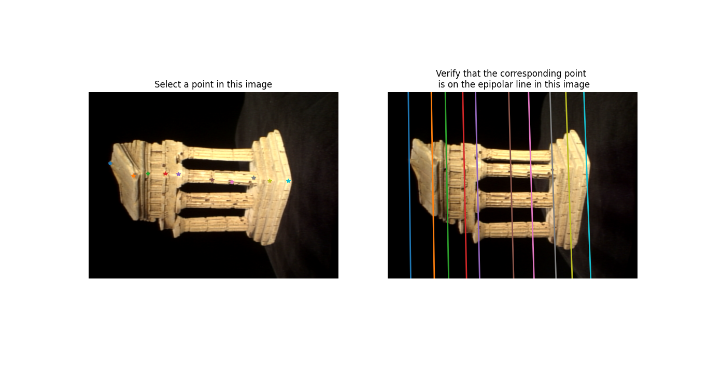
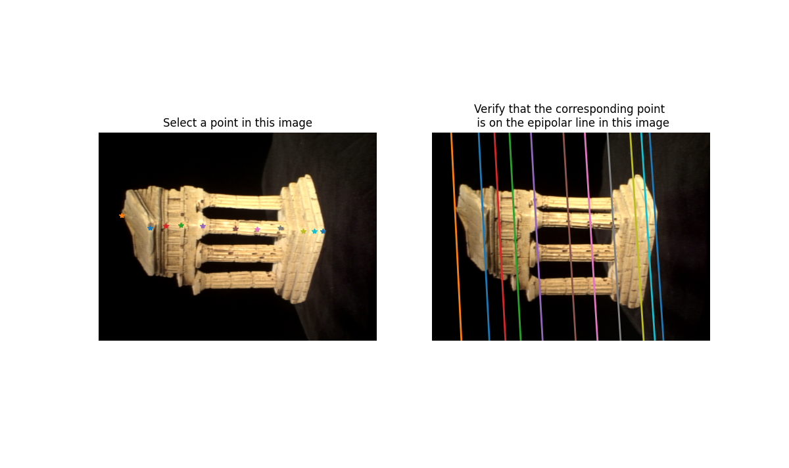
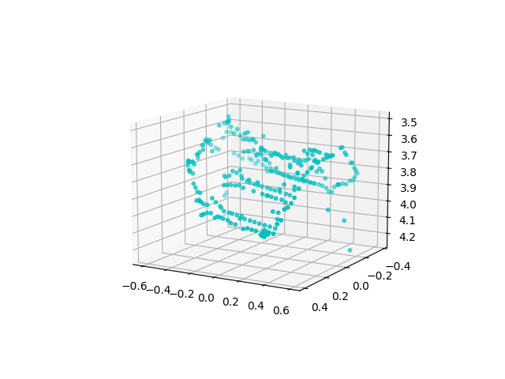
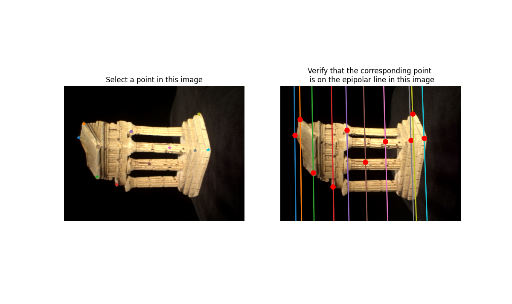
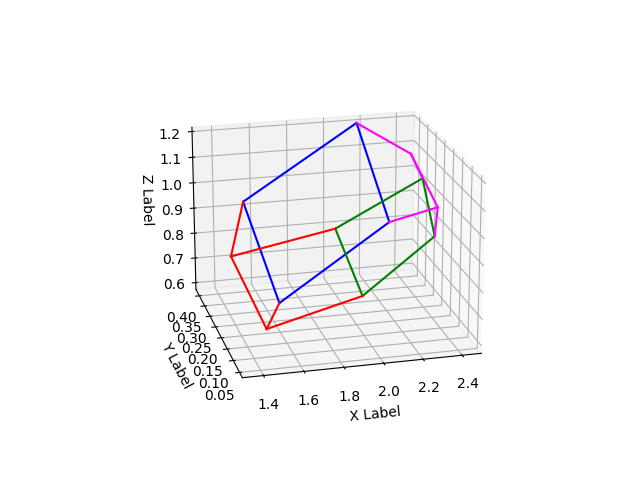
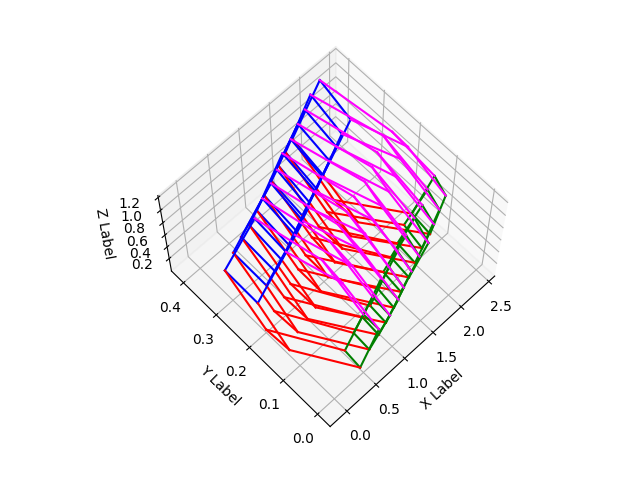

# 3D Reconstruction from Two Views

This project implements a complete **3D reconstruction pipeline** from
two-view and multi-view images using classical **multiple-view geometry**.

The system covers fundamental matrix estimation, triangulation,
epipolar correspondence, RANSAC, and bundle adjustment, following
standard Structure-from-Motion (SfM) techniques.

**Full technical details:**  
[Project Report (PDF)](./3d_reconstruction_report.pdf)

---

## Pipeline Overview

1. Fundamental matrix estimation (Eight-point & Seven-point)
2. Essential matrix computation
3. Camera pose recovery and triangulation
4. Epipolar correspondence for automatic matching
5. RANSAC for robust estimation
6. Bundle Adjustment for refinement
7. Multi-view 3D reconstruction

---

## Fundamental Matrix & Epipolar Geometry

### Eight-Point Algorithm

### Seven-Point Algorithm

---

## Triangulation & Metric Reconstruction

Recovered 3D structure of the temple scene using calibrated cameras.

---

## Epipolar Correspondence

Automatic correspondence search constrained along epipolar lines.

---

## Robust Estimation with RANSAC

Comparison between naive eight-point estimation and RANSAC-based estimation
under noisy correspondences.

---

## Bundle Adjustment

Joint optimization of camera pose and 3D points dramatically reduces
reprojection error.

- Initial error: **~925**
- After optimization: **~9**

---

## Multi-view 3D Reconstruction

3D reconstruction of a vehicle using multiple synchronized camera views.

