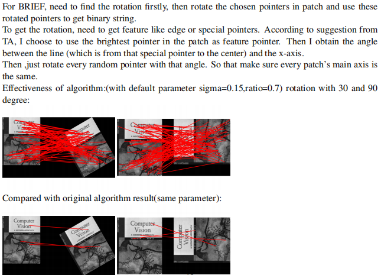
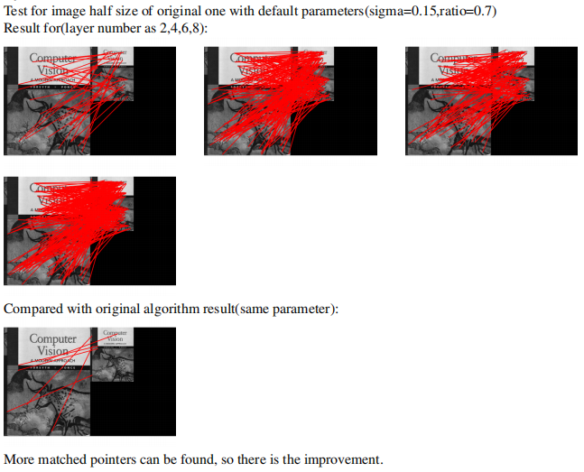
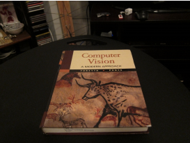
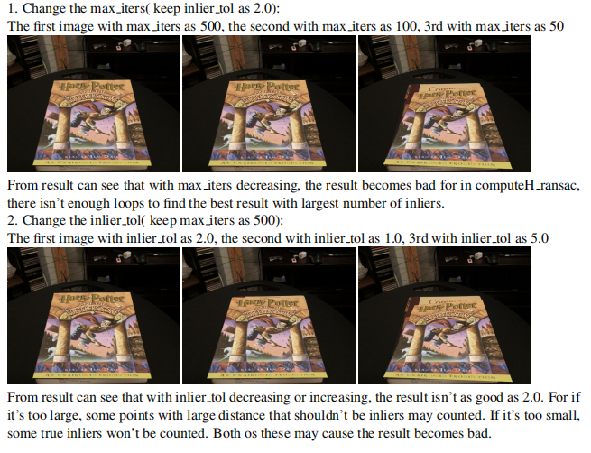
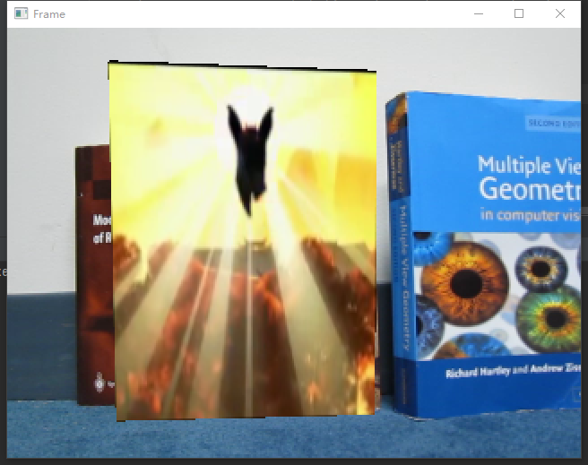
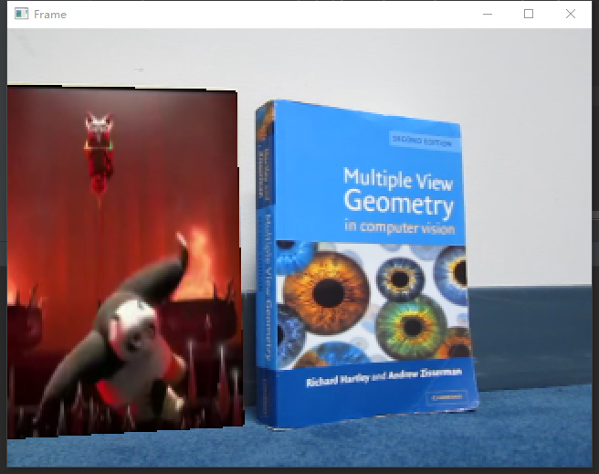

# Augmented Reality with Planar Homographies

This project implements a **classical feature-based augmented reality system**
using planar homographies, robust estimation, and perspective warping.

The system automatically detects planar surfaces in images and videos and
overlays virtual content with correct geometric alignment.

**Full technical details:**  
[Project Report (PDF)](./augmented_reality_homography_report.pdf)

---

## Pipeline Overview

1. FAST corner detection + BRIEF binary descriptors  
2. Feature matching with Hamming distance and ratio test  
3. Homography estimation using normalized DLT  
4. RANSAC for outlier rejection  
5. Image and video augmentation via perspective warping  

---

## Feature Matching

Keypoints are detected using **FAST** and described with **BRIEF**. Feature
correspondences are established using **Hamming distance**, followed by a ratio
test to remove ambiguous matches.

This approach provides efficient and repeatable matching suitable for real-time
geometric pipelines.

Screenshots from report:

Additional analysis on ratio thresholds and rotation sensitivity (highlighting
the lack of rotation invariance in BRIEF) can be found in the  
[Project Report (PDF)](./augmented_reality_homography_report.pdf).

---

## Robust Homography with RANSAC

A planar homography is estimated using **DLT with coordinate normalization** and
**SVD**. To handle mismatched features, **RANSAC** is applied to robustly select
inliers based on reprojection error, producing a stable transformation under
noise.

---

## Image-based AR Result

The estimated homography is used to warp and composite a target image onto a
planar surface in the scene.

When the template and reference images have different resolutions, a **scale
alignment (similarity transform)** is applied to feature coordinates prior to
homography estimation, ensuring a consistent planar coordinate system.

Original image:

Result:

---

## Video-based AR

The same feature-based pipeline is applied **frame-by-frame** to video,
allowing dynamic augmented reality on a moving planar target.

Homography estimation and perspective warping are performed per frame, with
lightweight optimizations for temporal stability and efficiency.

Click to watch:  

Image examples:

---
