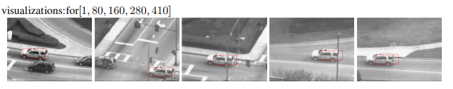
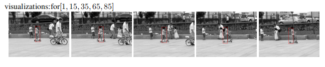
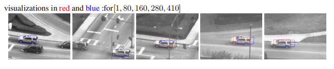
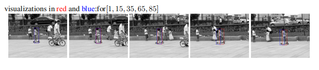
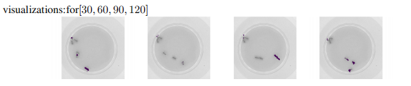
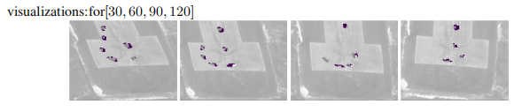
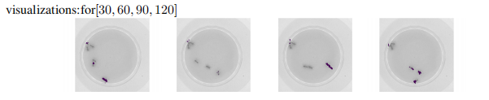
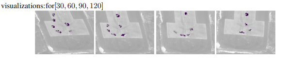
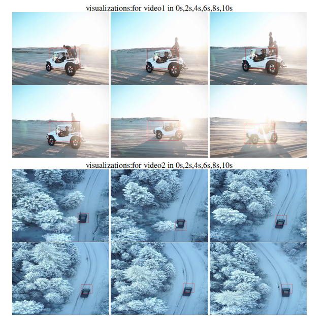

# Lucas–Kanade Tracking

This project implements the **Lucas–Kanade algorithm** for visual tracking,
covering translation, affine motion, and inverse compositional methods.

**Full technical details:**  
[Project Report (PDF)](./lucas_kanade_tracking_report.pdf)

---

## Implemented Methods

- Lucas–Kanade (Translation)
- Lucas–Kanade Affine
- Inverse Compositional Affine Tracking

---

## Tracking Results

### Tracking with naive template

### Tracking with and without template correction

### Affine Tracking

### Sequence Tracking

### My Tracking Test 

---
