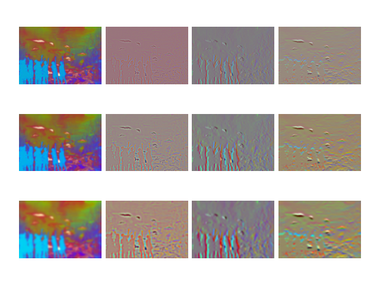
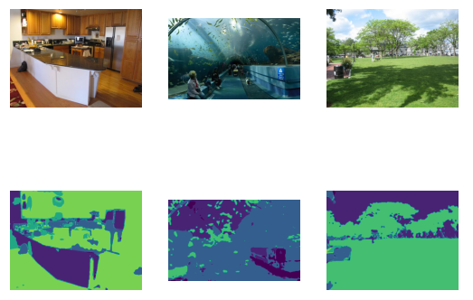
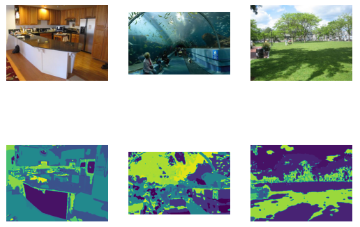
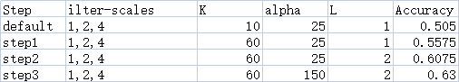

# Spatial Pyramid Matching for Scene Classification

This project implements a classic **scene classification system** based on  
**Bag of Visual Words (BoW)** and **Spatial Pyramid Matching (SPM)**, following
the seminal work by Lazebnik et al. (CVPR 2006).

**Full technical details:**  
[Project Report (PDF)](./spatial_pyramid_matching_report.pdf)

---

## Pipeline Overview

1. **Multi-scale filter bank feature extraction**
2. **K-means clustering** to build a visual word dictionary
3. **Wordmap generation** by assigning pixels to visual words
4. **Spatial Pyramid Matching (SPM)** feature encoding
5. **Scene classification** via nearest neighbor and neural network models

---

## Multi-scale Filter Bank Responses

The filter bank consists of Gaussian, Laplacian of Gaussian, and directional
derivatives at multiple scales, applied in the Lab color space.

---

## Visual Words Dictionary

Filter responses from training images are clustered using k-means to form a
dictionary of visual words.

---

## Wordmap Visualization

Each pixel is mapped to its nearest visual word.  
Larger dictionaries capture finer image structures.

**K = 10**

**K = 40**

---

## Recognition Performance

### Baseline: Nearest Neighbor + SPM
- Overall accuracy: **~50.5%**

- confusion matrix: 

| GT \ Pred | C0 | C1 | C2 | C3 | C4 | C5 | C6 | C7 |
|----------|----|----|----|----|----|----|----|----|
| **C0** | 31 | 1  | 6  | 0  | 2  | 0  | 6  | 4  |
| **C1** | 2  | 34 | 1  | 6  | 2  | 1  | 0  | 4  |
| **C2** | 2  | 3  | 17 | 0  | 2  | 7  | 0  | 19 |
| **C3** | 3  | 4  | 2  | 31 | 6  | 1  | 0  | 3  |
| **C4** | 3  | 2  | 5  | 10 | 15 | 5  | 7  | 3  |
| **C5** | 2  | 0  | 7  | 2  | 5  | 28 | 5  | 1  |
| **C6** | 8  | 1  | 2  | 0  | 5  | 7  | 22 | 5  |
| **C7** | 3  | 4  | 9  | 0  | 3  | 3  | 4  | 24 |

---

### Improved Model: Neural Network Classifier

1. By increasing K, we can get more kind of words in wordmap, so that more details can be
gotten for classification. Then we can get more features, and two similar image from different class
can be classified with these additional details.
2. By in creasing alpha, we get more input for building the dictionary. With more input pixels, the
dictionary can have more information about the image. When calling K-means, the more information
will provide better clustering.
3. By increasing layer number, the SPM method can divide the image into more parts and get more
histograms and features. With these more features, the two similar image from different class can be
classified.

### Further improvement

1. After getting features(hist), I build a neural-network model using tensorFlow in main():
NN model(opts):
Then use features as X input and labels as Y to fit the model. Then I get the prediction using the
features of test data.
2. Compared with simply using similarity for prediction, I think a neural-network can provide with
better results for accuracy.
3. The accuracy gets improved:

- New accuracy:0.6875
- New matrix:

| GT \ Pred | C0 | C1 | C2 | C3 | C4 | C5 | C6 | C7 |
|----------|----|----|----|----|----|----|----|----|
| **C0** | 40 | 0  | 1  | 1  | 1  | 2  | 3  | 2  |
| **C1** | 2  | 33 | 5  | 5  | 1  | 0  | 1  | 3  |
| **C2** | 2  | 2  | 32 | 0  | 1  | 1  | 8  | 4  |
| **C3** | 1  | 4  | 0  | 36 | 6  | 0  | 3  | 0  |
| **C4** | 1  | 2  | 1  | 11 | 30 | 2  | 1  | 2  |
| **C5** | 1  | 1  | 8  | 1  | 2  | 32 | 2  | 3  |
| **C6** | 2  | 0  | 2  | 0  | 3  | 2  | 39 | 2  |
| **C7** | 1  | 4  | 4  | 1  | 2  | 3  | 2  | 33 |

---

